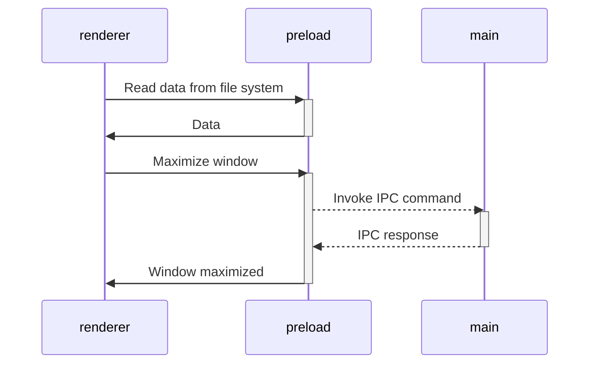

> [!Important]
> This project is maintained by developer from Ukraine 🇺🇦
> 
> I do my best, but due to Russia's ongoing full-scale invasion of Ukraine, I barely have the energy to support open source projects.
>
> If my work has been useful to you, please consider [supporting Ukraine](https://stand-with-ukraine.pp.ua/) or [me personally](https://send.monobank.ua/6SmojkkR9i). Even your **$1** has an impact!


# Belcorp Report


A secure Electron desktop application for processing and managing Belcorp incident tagging reports. Built with modern web technologies and following Electron security best practices.

## About This Project

This application provides a comprehensive solution for Belcorp's incident management workflow, featuring:

- **Excel Report Processing**: Parse and validate incident tagging data from ManageEngine reports
- **Data Management**: Store and manage incident tags with SQLite database integration
- **Modern UI**: React-based interface with TanStack Router for seamless navigation
- **Security First**: Electron application with context isolation and secure IPC communication
- **Domain-Driven Design**: Clean architecture with clear separation of concerns

> [!Important]
> This project is maintained by developer from Ukraine 🇺🇦
> 
> I do my best, but due to Russia's ongoing full-scale invasion of Ukraine, I barely have the energy to support open source projects.
> 
> If my work has been useful to you, please consider [supporting Ukraine](https://stand-with-ukraine.pp.ua/) or [me personally](https://send.monobank.ua/6SmojkkR9i). Even your **$1** has an impact!

## Get Started

Follow these steps to get started with the Belcorp Report application:

1. Clone this repository
2. Make sure you have [pnpm](https://pnpm.io/) installed globally:
   - `npm install -g pnpm` (if you have npm)
   - `corepack enable` (if you have Node.js 16.13+)
   - Or download from [pnpm.io/installation](https://pnpm.io/installation)
3. Install dependencies: `pnpm install`
4. Start application in development mode: `pnpm start`
5. Compile executable for production: `pnpm run compile`

That's all you need to run the Belcorp Report application! 🚀

> [!TIP]
> The application includes comprehensive Excel processing capabilities for incident tagging reports and a modern React interface for data management.

## Features

### Excel Report Processing
- **ManageEngine Integration**: Parse incident tagging reports from ManageEngine Report Framework
- **Data Validation**: Robust validation of Excel headers and row data using Zod schemas
- **Error Handling**: Comprehensive error reporting for malformed or invalid data
- **Batch Processing**: Efficient processing of large Excel files with progress tracking

### Data Management
- **SQLite Database**: Local SQLite database for persistent data storage
- **Domain-Driven Design**: Clean architecture with clear separation between domain, application, and infrastructure layers
- **Repository Pattern**: Abstract data access layer for flexible storage implementations
- **Type Safety**: Full TypeScript support with strict type definitions

### Modern Desktop Application
- **Electron Security**: Context isolation, secure IPC communication, and origin restrictions
- **React UI**: Modern React interface with TanStack Router for seamless navigation
- **Hash History**: Electron-compatible routing using hash-based navigation
- **Hot Reload**: Development server with hot module replacement for rapid development

### Architecture & Quality
- **Monorepo Structure**: Organized packages for main process, renderer, preload, and core business logic
- **Modular Design**: Plugin-based architecture with configurable modules
- **Testing**: E2E tests with Playwright for Electron applications
- **Code Quality**: Biome for linting and formatting, TypeScript for type safety

## Incident Tagging Workflow

The Belcorp Report application streamlines the incident management process through automated Excel report processing and data validation.

### Data Processing Pipeline

1. **Excel Import**: Users import ManageEngine Report Framework Excel files containing incident data
2. **Header Validation**: The application validates that all required columns are present:
   - Created Time, Request ID, Información Adicional, Modulo
   - Problem ID, Linked Request Id, Jira, Categorización, Technician
3. **Row Processing**: Each row is parsed and validated using Zod schemas
4. **Data Storage**: Validated incident tags are stored in the local SQLite database
5. **Error Reporting**: Invalid rows are reported with detailed error messages

### Expected Excel Format

The application expects Excel files with a sheet named "ManageEngine Report Framework" containing incident tagging data with hyperlinks for Request IDs and Problem IDs.

### Data Integrity

- **Type Safety**: Full TypeScript implementation with strict type checking
- **Schema Validation**: Zod schemas ensure data consistency and prevent invalid entries
- **Transaction Safety**: Database operations use transactions to maintain data integrity
- **Audit Trail**: All changes are timestamped with creation and update dates

### Testing & Quality Assurance

- **E2E Tests**: Playwright tests ensure the complete Excel import and data processing workflow
- **Type Checking**: Comprehensive TypeScript coverage across all packages
- **Code Quality**: Biome enforces consistent code style and catches potential issues

### Continuous Integration

- Automated type checking on every push and pull request
- Code signing support for secure distribution
- GitHub Actions workflow for automated builds and releases

## Project Structure

The Belcorp Report application is organized as a monorepo with clear separation of concerns across multiple packages. Each package has its own tech stack, dependencies, and build configuration.

### Core Packages

- [`packages/core`](packages/core) - Business logic and domain models for incident tagging
  - **Domain Layer**: Entities, interfaces, and business rules
  - **Application Layer**: Use cases and service orchestration
  - **Infrastructure Layer**: Concrete implementations (parsers, repositories, schemas)

- [`packages/database`](packages/database) - SQLite database management and migrations
  - Database initialization and schema management
  - Migration system for database versioning
  - Connection pooling and query optimization

### Electron Architecture Packages

- [`packages/main`](packages/main) - Electron main process implementation
  - **Module System**: Plugin-based architecture with `ModuleRunner`
  - **Security Modules**: Origin restrictions, IPC security, auto-updates
  - **Window Management**: Browser window lifecycle and configuration
  - **Database Integration**: SQLite database modules and repositories

- [`packages/preload`](packages/preload) - Secure bridge between main and renderer processes
  - Context isolation with `contextBridge.exposeInMainWorld()`
  - Base64-encoded function names for security
  - Node.js API exposure to renderer (file system, crypto, etc.)

- [`packages/renderer`](packages/renderer) - React-based user interface
  - **TanStack Router**: File-based routing with hash history for Electron
  - **Components**: Excel import UI, data visualization, navigation
  - **State Management**: React hooks and context for local state
  - **Styling**: Tailwind CSS for modern, responsive design

### Development & Build Tools

- [`packages/integrate-renderer`](packages/integrate-renderer) - Build tool for creating new renderer packages
- [`packages/electron-versions`](packages/electron-versions) - Helper utilities for Electron version management
- [`packages/dev-mode.js`](packages/dev-mode.js) - Development server orchestration
- [`packages/entry-point.mjs`](packages/entry-point.mjs) - Application entry point configuration

### Testing & Quality

- [`tests/`](tests) - End-to-end tests using Playwright with Electron integration
- [`biome.json`](biome.json) - Code linting and formatting configuration
- [`vitest.config.ts`](packages/renderer/vitest.config.ts) - Unit testing configuration

## How It works

### Compile executable

When an application is ready to distribute, you need to compile it into executable.
We are using [electron-builder] for
this.

- You can compile application locally by `pnpm run compile`.
  In this case, you will get executable that you cat share, but it will not support auto-updates out-of-box.
- To have auto-updater, you should compile an application and publish it to one or more supported sources for distribution. In this case, all application instances will download and apply all new updates. This is done by GitHub action in [release.yml](.github/workflows/release.yml).

> [!TIP]
> This template is configured to use GitHub Releases to distribute updates, but you can configure whatever you need.
> Find more in [electron-builder docs](https://www.electron.build/configuration/publish).


### Working with third-party dependencies

Because the `renderer` works and builds like a _regular web application_, you can only use dependencies that support the
browser or compile to a browser-friendly format.

This means that in the `renderer` you are free to use any frontend dependencies such as Vue, React, lodash, axios and so
on. However, you _CANNOT_ use any native Node.js APIs, such as, `systeminformation`. These APIs are _only_ available in
a Node.js runtime environment and will cause your application to crash if used in the `renderer` layer. Instead, if you
need access to Node.js runtime APIs in your frontend, export a function form the `preload` package.

All dependencies that require Node.js api can be used in
the [`preload` script](https://www.electronjs.org/docs/latest/tutorial/process-model#preload-scripts).

#### Expose in the main world

Here is an example. Let's say you need to read some data from the file system or database in the renderer.

In the preload context, create a function that reads and returns data. To make the function announced in the preload
available in the render, you usually need to call
the [`electron.contextBridge.exposeInMainWorld`](https://www.electronjs.org/ru/docs/latest/api/context-bridge).

However, this template is designed to use all power of ES modules.
You can import anything from `preload` in `renderer`.
All the data will quietly throw through the `electron.contextBridge.exposeInMainWorld()`,
so you don't need to worry about it.

```ts
// preload/src/index.ts
import {readFile} from 'node:fs/promises';

// Encapsulate types if you use typescript
interface UserData {
  prop: string
}

// Will call `electron.contextBridge.exposeInMainWorld('getUserData', getUserData)`
export function getUserData(): Promise<UserData> {
  return readFile('/path/to/file/in/user/filesystem.json', {encoding: 'utf8'}).then(JSON.parse);
}
```

Now you can import and call the method in renderer

```ts
// renderer/src/anywere/component.ts
import {getUserData} from '@app/preload'

// Method will came from exposed context
// const userData = globalThis['getUserData']
const userData = await getUserData()
```

> [!TIP]
> Find more
> in [Context Isolation tutorial](https://www.electronjs.org/docs/tutorial/context-isolation#security-considerations).

### Working with Electron API

Although the preload has access to all of Node.js API, it **still runs in the BrowserWindow context**, so only limited
electron modules are available in it.

> [!TIP]
> Check the [electron docs](https://www.electronjs.org/ru/docs/latest/api/clipboard) for the full list of available
> methods.

All other electron methods can be invoked in the `main`.

As a result, the architecture of interaction between all modules is as follows:



> [!TIP]
> Find more in [Inter-Process Communication tutorial](https://www.electronjs.org/docs/latest/tutorial/ipc).

### Modes and Environment Variables

All environment variables are set as part of the `import.meta`, so you can access them vie the following
way: `import.meta.env`.

> [!NOTE]
> If you are using TypeScript and want to get code completion,
> you must add all the environment variables to the [`ImportMetaEnv` in `types/env.d.ts`](types/env.d.ts).

The mode option is used to specify the value of `import.meta.env.MODE` and the corresponding environment variables files
that need to be loaded.

By default, there are two modes:

- `production` is used by default
- `development` is used by `pnpm start` script

When running the build script, the environment variables are loaded from the following files in your project root:

```
.env                # loaded in all cases
.env.local          # loaded in all cases, ignored by git
.env.[mode]         # only loaded in specified env mode
.env.[mode].local   # only loaded in specified env mode, ignored by git
```

> [!WARNING]
> To prevent accidentally leaking env variables to the client, only variables prefixed with `VITE_` are exposed to your
> Vite-processed code.

For example, let's take the following `.env` file:

```
DB_PASSWORD=foobar
VITE_SOME_KEY=123
```

Only `VITE_SOME_KEY` will be exposed as `import.meta.env.VITE_SOME_KEY` to your client source code, but `DB_PASSWORD`
will not.

> [!TIP]
> You can change that prefix or add another. See [`envPrefix`](https://vitejs.dev/config/shared-options.html#envprefix).

### PNPM Scripts

```sh
pnpm start
```
Start the Belcorp Report application in development mode with hot-reload.

---
```sh
pnpm run dev:libs
```
Start development mode for core business logic and database packages in watch mode.

---
```sh
pnpm run dev:full
```
Start both the library development servers and the full application simultaneously.

---
```sh
pnpm run build
```
Build all packages for production deployment.

---
```sh
pnpm run compile
```
Build all packages and create a distributable Electron executable using electron-builder.

---
```sh
pnpm run compile -- --dir -c.asar=false
```
Same as `pnpm run compile` but creates an unpacked build without ASAR archive (useful for debugging).

---
```sh
pnpm run test
```
Run end-to-end tests on the compiled application using Playwright.

---
```sh
pnpm run typecheck
```
Run TypeScript type checking across all packages.

---
```sh
pnpm run clean
```
Clean build artifacts and temporary files from all packages.

## Troubleshooting Common Issues

### Router and React Issues

**Problem: Blank screen in compiled Electron app**
- **Cause**: React 19 compatibility issues with Electron's rendering context
- **Solution**: The project uses hash history and proper error handling in `main.tsx`

**Problem: "Cannot read properties of null (reading '_store')" error**
- **Cause**: React 19's StrictMode conflicts with Electron environment
- **Solution**: Router setup avoids StrictMode and uses simplified rendering

**Problem: Routes showing "Not Found" in Electron**
- **Cause**: Browser history doesn't work with `file://` protocol
- **Solution**: Use `createHashHistory()` instead of `createBrowserHistory()`

### Windows Development Issues

**Problem: "EPERM: operation not permitted" during `pnpm run compile`**
- **Cause**: Windows symbolic link permissions and code signing requirements
- **Solution**: Code signing is disabled in `electron-builder.mjs`:
  ```javascript
  win: {
    forceCodeSigning: false,
    signAndEditExecutable: false
  }
  ```

**Problem: "d3dcompiler_47.dll" access errors during build**
- **Cause**: Windows file permissions during packaging
- **Solution**: Run terminal as administrator or exclude from antivirus scanning

### Development Server Issues

**Problem: "ENOENT: no such file or directory, scandir routes"**
- **Cause**: Router plugin looking for routes in wrong directory
- **Solution**: Ensure `vite.config.ts` has correct `routesDirectory: './src/routes'`

**Problem: Port conflicts (5173 already in use)**
- **Cause**: Previous dev server still running
- **Solution**: Kill Node.js processes: `Stop-Process -Name "node" -Force`

### Excel Processing Issues

**Problem: "Sheet 'ManageEngine Report Framework' not found"**
- **Cause**: Excel file doesn't contain the expected sheet name
- **Solution**: Ensure the Excel file has a sheet named exactly "ManageEngine Report Framework"

**Problem: "Missing required columns" error**
- **Cause**: Excel file is missing expected column headers
- **Solution**: Verify the Excel file contains all required columns: Created Time, Request ID, Información Adicional, Modulo, Problem ID, Linked Request Id, Jira, Categorización, Technician

**Problem: Database connection errors**
- **Cause**: SQLite database file permissions or corruption
- **Solution**: Delete the database file and restart the application to recreate it

### Bundle Size and Performance

**Current optimized bundle sizes:**
- Main bundle: ~293KB (includes full TanStack Router)
- DevTools bundle: ~48KB (development features)
- CSS bundle: ~6KB (Tailwind CSS)

## Configuration Files Modified

The following files contain project-specific configurations:

1. **`packages/renderer/src/main.tsx`** - Router setup with hash history
2. **`packages/renderer/vite.config.ts`** - Router plugin configuration
3. **`electron-builder.mjs`** - Windows build settings (code signing disabled)
4. **`packages/entry-point.mjs`** - Debug logging for path resolution
5. **`packages/main/src/index.ts`** - Dev tools configuration

## Contribution

See [Contributing Guide](CONTRIBUTING.md).


[vite]: https://github.com/vitejs/vite/

[electron]: https://github.com/electron/electron

[electron-builder]: https://github.com/electron-userland/electron-builder

[playwright]: https://playwright.dev
