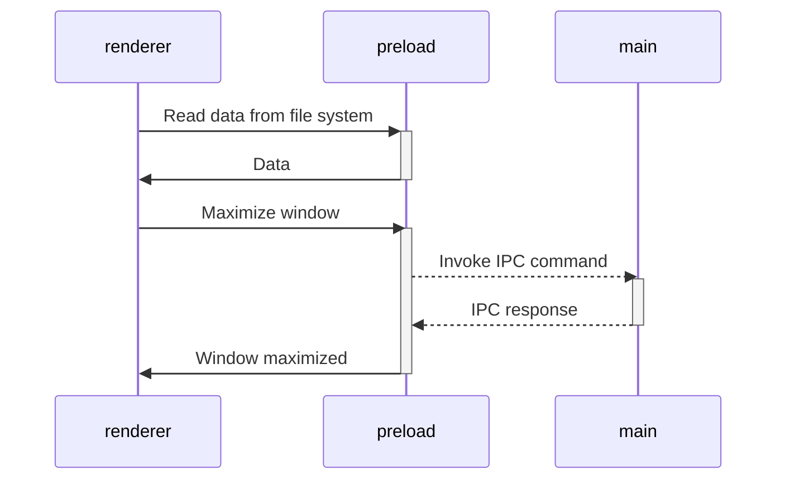

> [!Important]
> This project is maintained by developer from Ukraine 🇺🇦
> 
> I do my best, but due to Russia's ongoing full-scale invasion of Ukraine, I barely have the energy to support open source projects.
>
> If my work has been useful to you, please consider [supporting Ukraine](https://stand-with-ukraine.pp.ua/) or [me personally](https://send.monobank.ua/6SmojkkR9i). Even your **$1** has an impact!


# Vite Electron Builder Boilerplate


 


This is a template for secure electron applications. Written following the latest safety requirements, recommendations
and best practices.

## Get started

Follow these steps to get started with the template:

1. Click the **[Use this template](https://github.com/cawa-93/vite-electron-builder/generate)** button (you must be logged in) or just clone this repo.
2. Make sure you have [pnpm](https://pnpm.io/) installed globally:
   - `npm install -g pnpm` (if you have npm)
   - `corepack enable` (if you have Node.js 16.13+)
   - Or download from [pnpm.io/installation](https://pnpm.io/installation)
3. Go to project folder and run `pnpm run init`.
4. Start application in development mode by `pnpm start`.
5. Compile executable by `pnpm run compile`.
 
That's all you need. 😉

> [!TIP]
> You can explore the demo application for various frameworks and operating systems in the [Deployment](https://github.com/cawa-93/vite-electron-builder/deployments) section.
> This will allow you to see how the application performs across different environments.
> Additionally, you can verify the auto-update functionality by installing an outdated version of the application.

❤️ **If you like this template, give a ⭐ or [send support](https://www.buymeacoffee.com/kozack/)!**

## Features

### Lightweight
When designing this template, I tried to keep it minimal, using the platform's native features to the maximum and minimizing the number of third-party dependencies.

### Electron + TanStack Router Configuration

This project includes a fully configured **TanStack Router** setup optimized for Electron applications. This configuration solves common routing issues that occur when running React routers in Electron's `file://` protocol environment.

#### Key Configuration Details

**Hash History for Electron Compatibility:**
```typescript
// packages/renderer/src/main.tsx
import { RouterProvider, createRouter, createHashHistory } from '@tanstack/react-router'

// Create hash history for Electron compatibility (works with file:// protocol)
const hashHistory = createHashHistory()

const router = createRouter({
  routeTree,
  history: hashHistory,  // ← Critical for Electron apps
  context: {},
  defaultPreload: false,
  defaultPreloadStaleTime: 0,
})
```

**Vite Router Plugin Configuration:**
```typescript
// packages/renderer/vite.config.ts
import vitePlugin from '@tanstack/router-plugin/vite'

export default defineConfig({
  plugins: [
    vitePlugin({ 
      autoCodeSplitting: true,
      routesDirectory: './src/routes',
      generatedRouteTree: './src/routeTree.gen.ts'
    }),
    // ... other plugins
  ],
})
```

#### Why Hash History?

**The Problem:** Electron applications run on the `file://` protocol, which doesn't support browser history's `pushState` API. This causes routing failures with traditional browser history.

**The Solution:** Hash history (`/#/route`) works entirely client-side and is compatible with any protocol, making it perfect for Electron desktop applications.

#### Error Handling & Fallbacks

The router setup includes robust error handling:

```typescript
try {
  const root = ReactDOM.createRoot(rootElement)
  root.render(<RouterProvider router={router} />)
  console.log('TanStack Router rendered successfully')
} catch (error) {
  console.error('Router setup failed:', error)
  // Fallback to HTML content if React/Router fails
  rootElement.innerHTML = `<!-- Fallback content -->`
}
```

#### Development vs Production

- **Development (`pnpm start`)**: Router works with hot reload and dev tools
- **Production (`pnpm run compile`)**: Router compiles to ~293KB bundle with full functionality
- **Both environments**: Use identical hash-based routing for consistency

#### Troubleshooting

If you encounter routing issues:

1. **Blank Screen**: Check browser console for React errors
2. **"Not Found" Pages**: Ensure you're using `createHashHistory()`
3. **Route Generation**: Verify `routeTree.gen.ts` is being generated
4. **Windows Build Issues**: Code signing is disabled for development in `electron-builder.mjs`

#### File Structure

```
packages/renderer/src/
├── routes/
│   ├── __root.tsx      # Root layout component
│   └── index.tsx       # Home route (/)
├── main.tsx            # Router setup and app entry
└── routeTree.gen.ts    # Auto-generated route tree
```

### Electron

- This template uses the latest electron version with all the latest security patches.
- The architecture of the application is built according to the security [guides](https://www.electronjs.org/docs/tutorial/security) and best practices.
- The latest version of the [electron-builder] is used to package the application.

### Automatic tests

- End-to-end are placed in the root [`tests`](tests) directory and use [playwright].
- You may write any unit tests inside each package and use whatever you ~~want~~ need.

### Continuous Integration

- The configured workflow will check the types for each push and PR.
- Code signing supported. See [code-signing documentation](https://www.electron.build/code-signing.html).

### Auto-update

Each time you push changes to the `main` branch,
the [`ci`](.github/workflows/ci.yml) workflow starts to create and deploy a new application version with then will be downloaded and applied by each app instance.

## Project Structure

The project is designed as monorepo where each part of the application is an independent package.
Each package could have own tech stack, tests, dependencies, frameworks, etc.
All internal names are prefixed by `@app/*`.
There are no technical reasons for this.
It's just for you to make it easier to understand the architecture.

Initially, the repository contains only a few packages.4

### Packages with building tools:

- [`packages/integrate-renderer`](packages/integrate-renderer) - A helper package that is not included in the runtime.
  It is used in `pnpm run init` to configure a new interface package.
- [`packages/electron-versions`](packages/electron-versions) - A set of helper functions to get the versions of internal components bundled within Electron.

### Packages with app logic:

- [`packages/main`](packages/main) - Implementation of Electron's [**main script**](https://www.electronjs.org/docs/tutorial/quick-start#create-the-main-script-file).
- [`packages/preload`](packages/preload) - Implementation of Electron's [**preload scripts**](https://www.electronjs.org/docs/latest/tutorial/tutorial-preload).

### Renderer is not included

As you may have noticed, the repository does **not** contain a package that implements the application interface.
The reason is that since the entire application is a mono-repository,
you can use any web application based on any framework or bundler as a package for the interface.

There is only one requirement: the template expects to import renderer by `@app/renderer` name.

> [!TIP]
> You can create new renderer package in interactive mode by `pnpm run init`.

> [!NOTE]
> If you are using a bundler other than vite,
> you may need to slightly change the [dev-mode.js](packages/dev-mode.js) script to run it correctly.

## How It works

### Compile executable

When an application is ready to distribute, you need to compile it into executable.
We are using [electron-builder] for
this.

- You can compile application locally by `pnpm run compile`.
  In this case, you will get executable that you cat share, but it will not support auto-updates out-of-box.
- To have auto-updater, you should compile an application and publish it to one or more supported sources for distribution. In this case, all application instances will download and apply all new updates. This is done by GitHub action in [release.yml](.github/workflows/release.yml).

> [!TIP]
> This template is configured to use GitHub Releases to distribute updates, but you can configure whatever you need.
> Find more in [electron-builder docs](https://www.electron.build/configuration/publish).


### Working with third-party dependencies

Because the `renderer` works and builds like a _regular web application_, you can only use dependencies that support the
browser or compile to a browser-friendly format.

This means that in the `renderer` you are free to use any frontend dependencies such as Vue, React, lodash, axios and so
on. However, you _CANNOT_ use any native Node.js APIs, such as, `systeminformation`. These APIs are _only_ available in
a Node.js runtime environment and will cause your application to crash if used in the `renderer` layer. Instead, if you
need access to Node.js runtime APIs in your frontend, export a function form the `preload` package.

All dependencies that require Node.js api can be used in
the [`preload` script](https://www.electronjs.org/docs/latest/tutorial/process-model#preload-scripts).

#### Expose in the main world

Here is an example. Let's say you need to read some data from the file system or database in the renderer.

In the preload context, create a function that reads and returns data. To make the function announced in the preload
available in the render, you usually need to call
the [`electron.contextBridge.exposeInMainWorld`](https://www.electronjs.org/ru/docs/latest/api/context-bridge).

However, this template is designed to use all power of ES modules.
You can import anything from `preload` in `renderer`.
All the data will quietly throw through the `electron.contextBridge.exposeInMainWorld()`,
so you don't need to worry about it.

```ts
// preload/src/index.ts
import {readFile} from 'node:fs/promises';

// Encapsulate types if you use typescript
interface UserData {
  prop: string
}

// Will call `electron.contextBridge.exposeInMainWorld('getUserData', getUserData)`
export function getUserData(): Promise<UserData> {
  return readFile('/path/to/file/in/user/filesystem.json', {encoding: 'utf8'}).then(JSON.parse);
}
```

Now you can import and call the method in renderer

```ts
// renderer/src/anywere/component.ts
import {getUserData} from '@app/preload'

// Method will came from exposed context
// const userData = globalThis['getUserData']
const userData = await getUserData()
```

> [!TIP]
> Find more
> in [Context Isolation tutorial](https://www.electronjs.org/docs/tutorial/context-isolation#security-considerations).

### Working with Electron API

Although the preload has access to all of Node.js API, it **still runs in the BrowserWindow context**, so only limited
electron modules are available in it.

> [!TIP]
> Check the [electron docs](https://www.electronjs.org/ru/docs/latest/api/clipboard) for the full list of available
> methods.

All other electron methods can be invoked in the `main`.

As a result, the architecture of interaction between all modules is as follows:



> [!TIP]
> Find more in [Inter-Process Communication tutorial](https://www.electronjs.org/docs/latest/tutorial/ipc).

### Modes and Environment Variables

All environment variables are set as part of the `import.meta`, so you can access them vie the following
way: `import.meta.env`.

> [!NOTE]
> If you are using TypeScript and want to get code completion,
> you must add all the environment variables to the [`ImportMetaEnv` in `types/env.d.ts`](types/env.d.ts).

The mode option is used to specify the value of `import.meta.env.MODE` and the corresponding environment variables files
that need to be loaded.

By default, there are two modes:

- `production` is used by default
- `development` is used by `pnpm start` script

When running the build script, the environment variables are loaded from the following files in your project root:

```
.env                # loaded in all cases
.env.local          # loaded in all cases, ignored by git
.env.[mode]         # only loaded in specified env mode
.env.[mode].local   # only loaded in specified env mode, ignored by git
```

> [!WARNING]
> To prevent accidentally leaking env variables to the client, only variables prefixed with `VITE_` are exposed to your
> Vite-processed code.

For example, let's take the following `.env` file:

```
DB_PASSWORD=foobar
VITE_SOME_KEY=123
```

Only `VITE_SOME_KEY` will be exposed as `import.meta.env.VITE_SOME_KEY` to your client source code, but `DB_PASSWORD`
will not.

> [!TIP]
> You can change that prefix or add another. See [`envPrefix`](https://vitejs.dev/config/shared-options.html#envprefix).

### PNPM Scripts

```sh
pnpm start
```
Start application in development more with hot-reload.

---
```sh
pnpm run build
```
Runs the `build` command in all workspaces if present.

---
```sh
pnpm run compile
```
First runs the `build` script,
then compiles the project into executable using `electron-builder` with the specified configuration.

---
```sh
pnpm run compile -- --dir -c.asar=false
```
Same as `pnpm run compile` but pass to `electron-builder` additional parameters to disable asar archive and installer
creating.
Useful for debugging compiled application.

---
```sh
pnpm run test
```
Executes end-to-end tests on **compiled app** using Playwright.

---
```sh
pnpm run typecheck
```
Runs the `typecheck` command in all workspaces if present.

---
```sh
pnpm run create-renderer
```
Initializes a new Vite project named `renderer`. Basically same as `pnpm create vite`.

---
```sh
pnpm run integrate-renderer
```
Starts the integration process of the renderer using the Vite Electron builder.

---
```sh
pnpm run init
```
Set up the initial environment by creating a new renderer, integrating it, and installing the necessary packages.

## Troubleshooting Common Issues

### Router and React Issues

**Problem: Blank screen in compiled Electron app**
- **Cause**: React 19 compatibility issues with Electron's rendering context
- **Solution**: The project uses hash history and proper error handling in `main.tsx`

**Problem: "Cannot read properties of null (reading '_store')" error**
- **Cause**: React 19's StrictMode conflicts with Electron environment
- **Solution**: Router setup avoids StrictMode and uses simplified rendering

**Problem: Routes showing "Not Found" in Electron**
- **Cause**: Browser history doesn't work with `file://` protocol
- **Solution**: Use `createHashHistory()` instead of `createBrowserHistory()`

### Windows Development Issues

**Problem: "EPERM: operation not permitted" during `pnpm run compile`**
- **Cause**: Windows symbolic link permissions and code signing requirements
- **Solution**: Code signing is disabled in `electron-builder.mjs`:
  ```javascript
  win: {
    forceCodeSigning: false,
    signAndEditExecutable: false
  }
  ```

**Problem: "d3dcompiler_47.dll" access errors during build**
- **Cause**: Windows file permissions during packaging
- **Solution**: Run terminal as administrator or exclude from antivirus scanning

### Development Server Issues

**Problem: "ENOENT: no such file or directory, scandir routes"**
- **Cause**: Router plugin looking for routes in wrong directory
- **Solution**: Ensure `vite.config.ts` has correct `routesDirectory: './src/routes'`

**Problem: Port conflicts (5173 already in use)**
- **Cause**: Previous dev server still running
- **Solution**: Kill Node.js processes: `Stop-Process -Name "node" -Force`

### Bundle Size and Performance

**Current optimized bundle sizes:**
- Main bundle: ~293KB (includes full TanStack Router)
- DevTools bundle: ~48KB (development features)
- CSS bundle: ~6KB (Tailwind CSS)

## Configuration Files Modified

The following files contain project-specific configurations:

1. **`packages/renderer/src/main.tsx`** - Router setup with hash history
2. **`packages/renderer/vite.config.ts`** - Router plugin configuration
3. **`electron-builder.mjs`** - Windows build settings (code signing disabled)
4. **`packages/entry-point.mjs`** - Debug logging for path resolution
5. **`packages/main/src/index.ts`** - Dev tools configuration

## Contribution

See [Contributing Guide](CONTRIBUTING.md).


[vite]: https://github.com/vitejs/vite/

[electron]: https://github.com/electron/electron

[electron-builder]: https://github.com/electron-userland/electron-builder

[playwright]: https://playwright.dev
